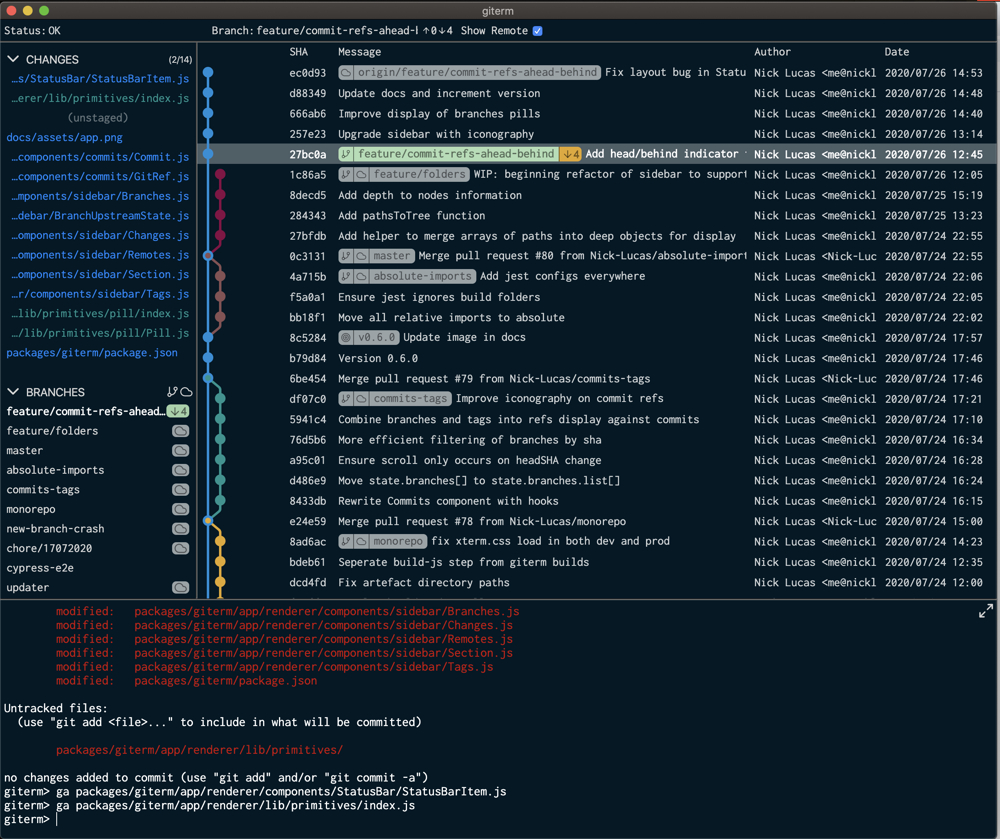

## giterm

Electron/React based git tool, with a terminal at its heart, and all the best parts of a git GUI.

This project is still under heavy development, and any contributions or feedback are very welcome! 

I'm building giterm because I love to work on the CLI but miss the visualisation and simplicity which git GUIs can offer. That's the vision!

## How to run it?

I'm still prototyping so haven't sorted the production build yet. 

1. checkout
2. `yarn`/`npm` (NodeGit can take a while to build, so be patient)
3. `yarn run develop` or `npm run develop`. 

## Usage

Load up giterm and use the command line as normal! 

* When you change folder so will giterm
* giterm has a bunch of bash aliases ready for you (type `help`)
* If you want a fullscreen terminal just press `ctrl+tab` to toggle it

## Work in progress!

* giterm probably only works on Mac right now. There are some dependencies like bash and lsof/grep/awk which are currently required
* Cross-platform support is a personal priority! I'm also a Windows user at times, and Linux should be trivial with Mac support. Help here is especially welcome.

## TODO:

###### At some point I will move these into github issues

* App
  * Support opening from command line
  * Change app name and icon
  * Make production build/packaging work for Mac
  * Support Windows & Linux
  * Keyboard shortcuts display

* General
  * Unit / integration tests! As soon as the prototype is done

* Config
  * set default directory for when the app is opened
  * set bash location
  * set git auth info? ssh? is this even needed if the target audience has SSH/HTTP already set up for CLI?

* Terminal
  * Performance: moving up/down in VIM causes a giterm refresh to trigger
  * Allow switching to non-root git folders.

* Status bar
  * Give functility for jump-to-branch and jump-to-commit

* Commits view
  * Support column resizing (manual or auto)
  * Show branch ahead/behind counts
  * Scroll to branch head when branch switched from command-line
  * Support merge and rebase with mouse
  * Load more than 500 commits on scroll down

* Branches view: (Not yet implemented)
  * List local branches
  * Mark current branch
  * Display commits ahead/behind
  * Double click to check out
  * Right click the rename, delete, etc