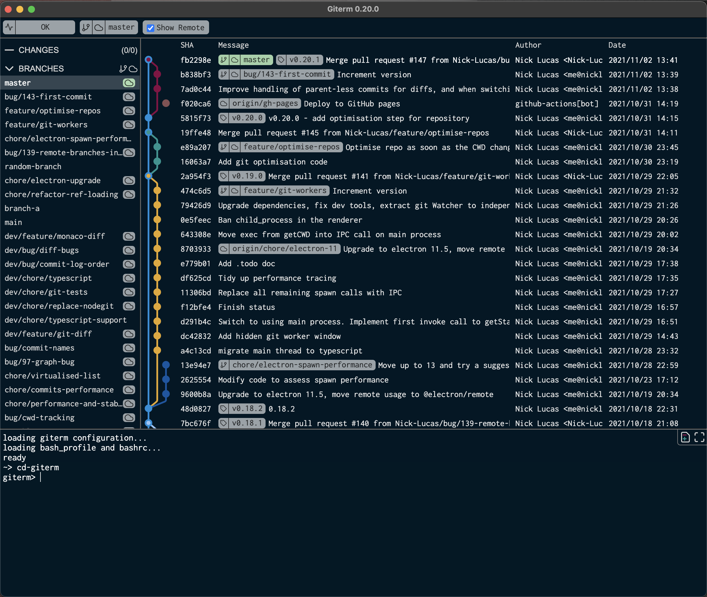

## Giterm

Giterm is a GUI with the terminal at its heart, and all the best parts of a Git GUI. 

* Want to open a repository? Just `cd ./your-repo` like normal
* Want to make the terminal full-screen? `ctrl+tab`
* Want to understand the recent merge history? The Git Graph is right there
* Just need to grab a SHA or branch name? Right click on it in the GUI
* Type `help` for a list of Giterm Git aliases

The vision of Giterm is to make the time-consuming and weaker bits of the Git CLI faster and easier, while keeping the core CLI experience at the front.

Giterm is still under heavy development, and any contributions or feedback are very welcome! 

|Platform Support|||
|-|-|-|
|Mac| 🟢 Supported and developed against | [Download](https://github.com/Nick-Lucas/giterm/releases/latest)
|Linux| 🟠 Supported but not actively tested. Open an issue if you have problems | [Download](https://github.com/Nick-Lucas/giterm/releases/latest)
|Windows| ❗️Due to platform limitations with tracking the terminal's CWD the current build won't work. Help & ideas welcome! |

## Building locally

1. checkout
2. `yarn` (Native modules like NodeGit can take ages to build, so be patient)
3. `yarn run dev` 

## Contributing

Contributions are welcome. Check out the github issues for ideas on what needs doing, or open an issue if you have any feature requests or ideas.
